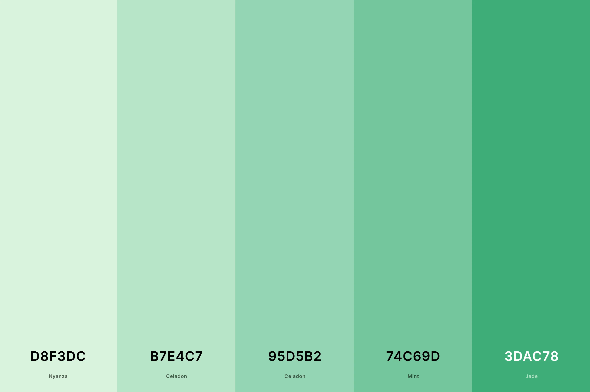
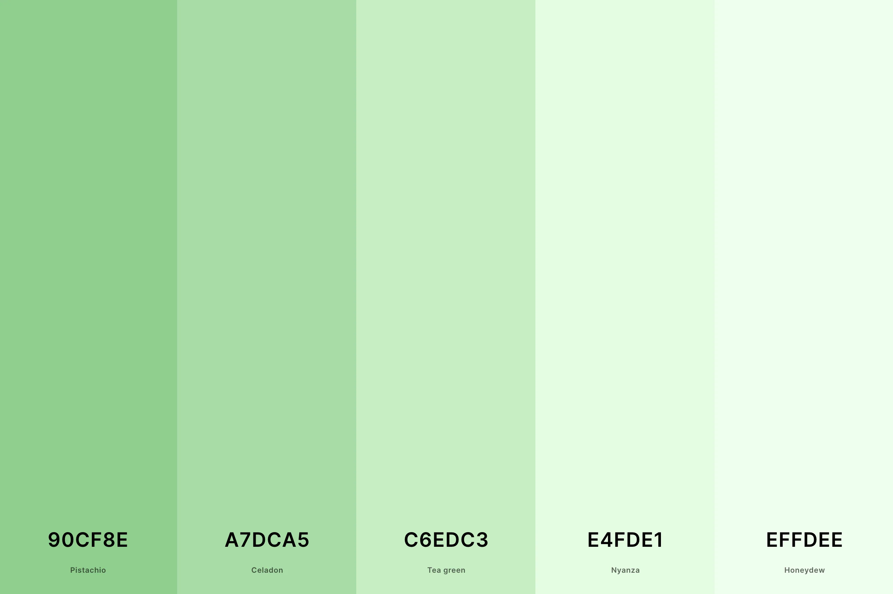

# React + Vite

This template provides a minimal setup to get React working in Vite with HMR and some ESLint rules.

Currently, two official plugins are available:

- [@vitejs/plugin-react](https://github.com/vitejs/vite-plugin-react/blob/main/packages/plugin-react/README.md) uses [Babel](https://babeljs.io/) for Fast Refresh
- [@vitejs/plugin-react-swc](https://github.com/vitejs/vite-plugin-react-swc) uses [SWC](https://swc.rs/) for Fast Refresh

inspire website:
- https://tmrwstudio.net/atlas/eight/
- https://preview.themeforest.net/item/zento-modern-lightweight-blog-for-wordpress/full_screen_preview/51579969

colors:

Hex Codes: `#D8F3DC, #B7E4C7, #95D5B2, #74C69D, #3DAC78`

Hex Codes: `#90CF8E, #A7DCA5, #C6EDC3, #E4FDE1, #EFFDEE`